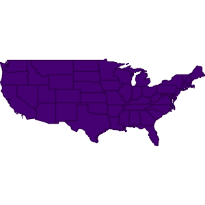
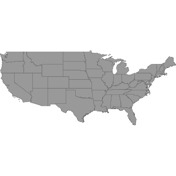

.. _learning.map:

Map and Styles
==============

.. cssclass:: show-chooser

.. rubric:: code chooser

A :class:`Map` can draw one or more :class:`Layers` using :class:`Styles`.

.. cssclass:: code groovy

.. code-block:: groovy

    groovy:000> import geoscript.map.Map
    ===> [import geoscript.map.Map]

    groovy:000> map = new Map(width:400, height:400) 
    ===> geoscript.map.Map@f58046e

    groovy:000> import geoscript.layer.Shapefile
    ===> [import geoscript.map.Map, import geoscript.layer.Shapefile]

    groovy:000> shp = new Shapefile("states.shp")
    ===> geoscript.layer.Shapefile@a5c18ff

    groovy:000> map.bounds = shp.bounds
    ===> (-124.73142200000001,24.955967,-66.969849,49.371735,EPSG:4326)

    groovy:000> map.addLayer(shp)
    ===> null

    groovy:000> map.render("states1.png")
    ===> null

.. cssclass:: code js

.. code-block:: javascript

    >> var Map = require("geoscript/map").Map;
    >> var Layer = require("geoscript/layer").Layer;

    >> var map = new Map();
    >> var layer = new Layer({
    ..     name: "states", 
    ..     workspace: "data"
    .. });
    >> map.add(layer);
    >> map.render({path: "states1.png"});

Layers have a default Style but we can customize that Style with Rules and Symbolizers.

.. cssclass:: code groovy

.. code-block:: groovy

    groovy:000> import geoscript.style.*
    ===> [import geoscript.map.Map, import geoscript.layer.Shapefile, import geoscript.style.*]

    groovy:000> shp.style = new Style(new PolygonSymbolizer(strokeColor: "#666666", fillColor: "#999999", strokeWidth: 0.1))
    ===> geoscript.style.Style@17609872
    
    groovy:000> map.render("states2.png")
    ===> null

.. cssclass:: code js

.. code-block:: javascript

    >> layer.style = {
    ..     fillColor: "#999999",
    ..     strokeColor: "#666666",
    ..     strokeWidth: 0.1
    .. };
    >> map.render({path: "states2.png"});
    

