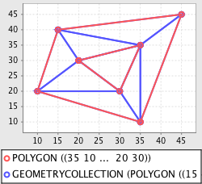

.. _tutorials.geom-advanced:

Geometry Advanced
=================

The tutorial introduces some more advanced concepts of the geometry module such as:

* Simplification
* Affine transformation
* Voronoi diagrams and Delaunay triangulation

Prerequisites
-------------

It is recommended that the :ref:`tutorials.geom-basic` tutorial be completed before proceeding.

Simplification
--------------

The *simplify* function is used to reduce the number of coordinates composing a geometry, using
the `Douglas-Peucker <http://en.wikipedia.org/wiki/Ramer–Douglas–Peucker_algorithm>`_ algorithm.

.. cssclass:: code py

.. code-block:: python

    >>> from geoscript.geom import *
    >>> from geoscript.render import plot

    >>> poly = Point(0,0).buffer(1);
    >>> plot(poly);

    >>> plot(simplify(poly, 0.05));
    >>> plot(simplify(poly, 0.1));

.. cssclass:: code js

.. code-block:: javascript

    js> require("geoscript/viewer").bind()
    js> var geom = require("geoscript/geom")

    js> var poly = geom.Point([0, 0]).buffer(1);
    js> poly
    <Polygon [[[1, 0], [0.9807852804032304, -0.19509032201612825], [0.923...>

    js> poly.simplify(0.05)
    <Polygon [[[1, 0], [0.9238795325112867, -0.3826834323650898], [0.7071...>

    js> poly.simplify(0.1) 
    <Polygon [[[1, 0], [0.7071067811865476, -0.7071067811865475], [6.1232...>
   
.. cssclass:: code groovy

.. code-block:: groovy

    groovy:000> import geoscript.geom.*
    groovy:000> import geoscript.render.Plot

    groovy:000> poly = new Point(0,0).buffer(1)
    
    groovy:000> Plot.plot(poly)
    
    groovy:000> Plot.plot(poly.simplify(0.05))
    groovy:000> Plot.plot(poly.simplify(0.1)) 
    

.. image:: simplify2.png

.. image:: simplify3.png

.. cssclass:: refs py

.. seealso::

   `simplify API reference <../../py/api/geom/index.html#geoscript.geom.geom.simplify>`__

.. cssclass:: refs groovy
    
.. seealso::

    `simplify API reference <../../groovy/api//geoscript/geom/Geometry.html#simplify(double)>`__

    `simplify preserving topology API reference <../../groovy/api//geoscript/geom/Geometry.html#simplifyPreservingTopology(double)>`__

Transformations
---------------

The *transform* function is used to apply an affine (linear) transformation to a geometry object.
Transformation properties include displacement, scaling, shearing, and rotation. 

.. cssclass:: code py

.. code-block:: python

    >>> import math
    >>> from geoscript.geom import *
    >>> from geoscript.render import plot

    # displacement
    >>> poly = Point(0,0).buffer(1);
    >>> plot([poly, transform(poly, dx=0.75)])

    # scale + shear
    >>> poly = Polygon([(0,0),(1,0),(1,1),(0,1),(0,0)])
    >>> plot([poly, transform(sx=2, sy=2, shx=1)])

    # rotation
    >>> poly = Polygon([(-5,-2),(5,-2),(5,2),(-5,2), (-5,-2)])
    >>> poly = poly.union(transform(poly, r=math.degrees(90)))
    >>> plot([poly, transform(poly, r=math.degrees(45))])

.. cssclass:: code js

.. code-block:: javascript

    js> require("geoscript/viewer").bind()          
    js> var geom = require("geoscript/geom")

    js> var poly = geom.Point([0, 0]).buffer(1);
    js> poly.transform({dx: 0.75})
    <Polygon [[[1.75, 0], [1.7307852804032304, -0.19509032201612825], [1....>

    js> poly = geom.Polygon([[[0,0], [1,0], [1,1], [0,1], [0,0]]])
    <Polygon [[[0, 0], [1, 0], [1, 1], [0, 1], [0, 0]]]>

    js> poly.transform({sx: 2, sy: 2, shx: 1})
    <Polygon [[[0, 0], [2, 0], [3, 2], [1, 2], [0, 0]]]>

    js> poly = geom.Polygon([[[-5,-2], [5,-2], [5,2], [-5,2], [-5,-2]]])
    <Polygon [[[-5, -2], [5, -2], [5, 2], [-5, 2], [-5, -2]]]>

    js> poly = poly.union(poly.transform({rotation: 90 * (Math.PI / 180)}))
    <Polygon [[[-2, -2], [-5, -2], [-5, 2], [-2, 2], [-2, 5], [2, 5], [2,...>

.. cssclass:: code groovy

.. code-block:: groovy

    groovy:000> import geoscript.geom.*
    groovy:000> import static geoscript.render.Plot.plot

    // displacement
    groovy:000> poly = new Point(0,0).buffer(1)
    groovy:000> plot([poly, poly.translate(0.75,0)])
    
    // scale + shear
    groovy:000> poly = new Polygon([[[0,0],[1,0],[1,1],[0,1],[0,0]]])
    groovy:000> plot([poly, poly.scale(2,2).shear(1,0)])
    
    // rotation
    groovy:000> poly = new Polygon([[[-5,-2],[5,-2],[5,2],[-5,2],[-5,-2]]]) 
    groovy:000> poly = poly.union(poly.rotate(Math.toRadians(90)))
    groovy:000> plot([poly, poly.rotate(Math.toRadians(45))])

.. image:: transform1.png

.. image:: transform2.png

.. image:: transform3.png

.. cssclass:: refs py

.. seealso::

   `transform API reference <../../py/api/geom/index.html#geoscript.geom.geom.transform>`__

.. cssclass:: refs groovy
    
.. seealso::

    `transform API reference <../../groovy/api/geoscript/geom/Geometry.html>`__

Delaunay Triangulation and Voronoi Diagrams
-------------------------------------------

For a set of input points (sites) in a given space, a 
`Voronoi diagram <http://en.wikipedia.org/wiki/Voronoi_diagram>`_ computes a tessellation (set of
polygons) of that space such that for each point p, the containing polygon consists of all points
closer to p than any other point.

In order to compute a Voronoi diagram, a 
`Delaunay triangulation <http://en.wikipedia.org/wiki/Delaunay_triangulation>`_ is first computed
on the input points. 

.. cssclass:: code py

.. code-block:: python

    >>> from geoscript.geom import *
    >>> from geoscript.render import plot

    >>> poly = Polygon([(35,10), (10,20), (15,40), (45,45), (35,10)], [(20,30), (35,35), (30,20), (20,30)])
    >>> dt = delaunay(poly)
    >>> plot([poly, dt[0]])

    >>> vd = voronoi(poly)
    >>> plot([poly, vd])

.. cssclass:: code groovy

.. code-block:: groovy
    
    groovy:000> import geoscript.geom.*
    groovy:000> import static geoscript.render.Plot.plot
        
    groovy:000> poly = new Polygon([[[35,10], [10,20], [15,40], [45,45], [35,10]], [[20,30], [35,35], [30,20], [20,30]]])
    groovy:000> dt = poly.delaunayTriangleDiagram
    groovy:000> plot([poly, dt])

    groovy:000> vd = poly.voronoiDiagram
    groovy:000> plot([poly, vd])

.. image:: voronoi2.png

.. cssclass:: refs py

.. seealso::

   `delaunay API reference <../../py/api/geom/index.html#geoscript.geom.geom.delaunay>`__

   `voronoi API reference <../../py/api/geom/index.html#geoscript.geom.geom.voronoi>`__

.. cssclass:: refs groovy
    
.. seealso::

   `delaunay API reference <../../groovy/api/geoscript/geom/Geometry.html#getDelaunayTriangleDiagram(boolean)>`__

   `voronoi API reference <../../groovy/api/geoscript/geom/Geometry.html#getVoronoiDiagram()>`__
   
    
