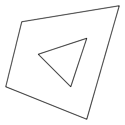
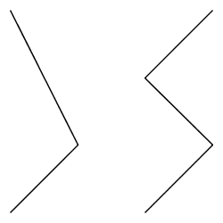
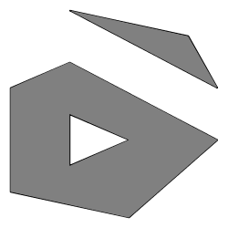
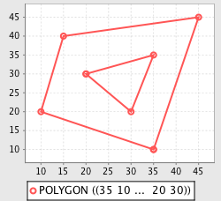
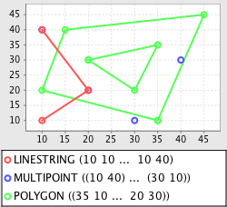

.. _tutorials.geom-basic:

Geometry Basics
===============

.. cssclass:: show-chooser

.. rubric:: code chooser

This tutorial introduces the basic classes, methods, and functions of the 
geometry module. It focuses mainly on basic topics such as:

* Construction and manipulation
* Operations and analysis functions
* Serialization and deserialization of geometry objects to and from various formats
* Visualization

JTS
---

The `JTS Topology Suite <http://tsusiatsoftware.net/jts/main.html>`_ is in some way at the core
of any Java application doing geospatial. It is the geometry engine upon which libraries such as
GeoTools are built on. The GeoScript geometry module is for the most part a wrapper around JTS
that adds some convenience functions making JTS more useful in a scripting environment. Which 
ultimately means that whatever you can with JTS you can do with GeoScript, only often with much
less effort.

Geometry Objects
----------------

Geometry objects are constructed specifying sets of coordinates to the various Geometry 
constructors. 

.. cssclass:: code py

.. code-block:: python

    >>> from geoscript.geom import *

    >>> Point(30, 10)
    POINT(30 10)

    >>> LineString((30,10), (10,30), (20,40), (40,40))  
    LINESTRING (30 10, 10 30, 20 40, 40 40)

    >>> Polygon([(30,10), (10,20), (20,40), (40,40), (30,10)])
    POLYGON ((30 10, 10 20, 20 40, 40 40, 30 10))
    
    # polygon with hole
    >>> Polygon([(35,10), (10,20), (15,40), (45,45), (35,10)], [(20,30), (35,35), (30,20), (20,30)])
    POLYGON ((35 10, 10 20, 15 40, 45 45, 35 10), (20 30, 35 35, 30 20, 20 30))

    >>> MultiPoint((10,40), (40,30), (20,20), (30,10))
    MULTIPOINT ((10 40), (40 30), (20 20), (30 10))
    
    >>> MultiPoint(Point(10,40), Point(40,30), Point(20,20), Point(30,10))
    MULTIPOINT ((10 40), (40 30), (20 20), (30 10))

    >>> MultiLineString([(10,10), (20,20), (10,40)], [(40,40), (30,30), (40,20), (30,10)])
    MULTILINESTRING ((10 10, 20 20, 10 40), (40 40, 30 30, 40 20, 30 10))
    
    >>> MultiPolygon([[(30,20), (10,40), (45,40), (30,20)]], [[(15,5), (40,10), (10,20), (5,10), (15,5)]])
    MULTIPOLYGON (((30 20, 10 40, 45 40, 30 20)), ((15 5, 40 10, 10 20, 5 10, 15 5)))

.. cssclass:: code js

.. code-block:: javascript

    js> var geom = require("geoscript/geom")

    js> geom.Point([30, 10])
    <Point [30, 10]>

    js> geom.LineString([[30,10], [10,30], [20,40], [40,40]])
    <LineString [[30, 10], [10, 30], [20, 40], [40, 40]]>

    js> geom.Polygon([[[30,10], [10,20], [20,40], [40,40], [30,10]]])
    <Polygon [[[30, 10], [10, 20], [20, 40], [40, 40], [30, 10]]]>

    js> geom.Polygon([[[35,10], [10,20], [15,40], [45,45], [35,10]], [[20,30], [35,35], [30,20], [20,30]]])
    <Polygon [[[35, 10], [10, 20], [15, 40], [45, 45], [35, 10]], [[20, 3...>

    js> geom.MultiPoint([[10,40], [40,30], [20,20], [30,10]])
    <MultiPoint [[10, 40], [40, 30], [20, 20], [30, 10]]>

    js> geom.MultiPoint([geom.Point([10,40]), geom.Point([40,30]), geom.Point([20,20]), geom.Point([30,10])])
    <MultiPoint [[10, 40], [40, 30], [20, 20], [30, 10]]>

    js> geom.MultiLineString([[[10,10], [20,20], [10,40]], [[40,40], [30,30], [40,20], [30,10]]])
    <MultiLineString [[[10, 10], [20, 20], [10, 40]], [[40, 40], [30, 30], [40, 2...>

    js> geom.MultiPolygon([[[[30,20], [10,40], [45,40], [30,20]]], [[[15,5], [40,10], [10,20], [5,10], [15,5]]]])
    <MultiPolygon [[[[30, 20], [10, 40], [45, 40], [30, 20]]], [[[15, 5], [40,...>

.. cssclass:: refs py

.. seealso::

   `geom API reference <../py/api/geom/index.html>`__

.. cssclass:: refs js

.. seealso::

   `geom API reference <../js/api/geom.html>`__

Operations
----------

Geometry objects offer a number of methods for calculating various properties including *area*, *length*, and *validity*. 

.. cssclass:: code py

.. code-block:: python

    >>> from geoscript.geom import *

    # area
    >>> poly = Polygon([(30,10), (10,20), (20,40), (40,40), (30,10)])
    >>> poly.area
    550.0
    
    # length
    >>> line = LineString((30,10), (10,20), (20,40), (40,40), (30,10))  
    >>> line.length
    96.34413615167959

    # validity
    >>> poly.valid
    True

    # self intersecting polygon
    >>> poly = Polygon([(1,1), (2,1), (1,0), (2,0), (1,1)])
    >>> poly.valid
    False

.. cssclass:: code js

.. code-block:: javascript

    js> var {Polygon, LineString} = require("geoscript/geom");

    js> // polygon area
    js> var poly = Polygon([[[30,10], [10,20], [20,40], [40,40], [30,10]]])     
    js> poly.area
    550

    js> // line length
    js> var line = line = LineString([[30,10], [10,20], [20,40], [40,40], [30,10]])
    js> line.length
    96.34413615167959

    js> // geometry validity
    js> poly.valid
    true

    js> // self-intersecting polygon
    js> poly = Polygon([[[1,1], [2,1], [1,0], [2,0], [1,1]]])
    <Polygon [[[1, 1], [2, 1], [1, 0], [2, 0], [1, 1]]]>
    js> poly.valid
    false

Other operations such as *intersection*, *union*, *difference*, and *distance* calculate relationships between two geometry objects.

.. cssclass:: code py

.. code-block:: python

    >>> from geoscript.geom import *

    # distance
    >>> point = Point(30, 10)
    >>> point.distance(Point(40,30))
    22.360679774997898

    >>> line = LineString((30,10), (10,30), (20,40), (40,40))
    >>> line.distance(point)
    0.0

    # intersection
    >>> line.intersects(point)
    True
    >>> line.intersection(point)
    POINT (30 10)

    # union
    >>> poly1 = Polygon([(0,0), (2,0), (2,2), (0,2), (0,0)])
    >>> poly2 = Polygon([(1,1), (3,1), (3,3), (1,3), (1,1)])
    >>> poly1.union(poly2)
    POLYGON ((2 1, 2 0, 0 0, 0 2, 1 2, 1 3, 3 3, 3 1, 2 1))

    # difference
    >>> poly1.difference(poly2)
    POLYGON ((2 1, 2 0, 0 0, 0 2, 1 2, 1 1, 2 1))

    # symmetric difference
    >>> poly1.symDifference(poly2)
    MULTIPOLYGON (((2 1, 2 0, 0 0, 0 2, 1 2, 1 1, 2 1)), ((2 1, 2 2, 1 2, 1 3, 3 3, 3 1, 2 1)))

.. cssclass:: code js

.. code-block:: javascript

    js> var {Point, Polygon, LineString} = require("geoscript/geom");

    js> // distance
    js> var point = Point([30, 10])
    js> point.distance(Point([40, 30]))
    22.360679774997898

    js> var line = LineString([[30,10], [10,30], [20,40], [40,40]])
    js> line.distance(point)
    0

    // intersection
    js> line.intersects(point)
    true

    js> line.intersection(point)
    <Point [30, 10]>

    js> // union
    js> var poly1 = Polygon([[[0,0], [2,0], [2,2], [0,2], [0,0]]])
    js> var poly2 = Polygon([[[1,1], [3,1], [3,3], [1,3], [1,1]]])
    js> poly1.union(poly2)
    <Polygon [[[2, 1], [2, 0], [0, 0], [0, 2], [1, 2], [1, 3], [3, 3], [3...>
    
    js> // difference
    js> poly1.difference(poly2)
    <Polygon [[[2, 1], [2, 0], [0, 0], [0, 2], [1, 2], [1, 1], [2, 1]]]>
    
    js> // symmetric difference
    js> poly1.symDifference(poly2)
    <MultiPolygon [[[[2, 1], [2, 0], [0, 0], [0, 2], [1, 2], [1, 1], [2, 1]]],...>

Operations such as *buffer* compute a new geometry object from an existing one.

.. cssclass:: code py

.. code-block:: python

    >>> from geoscript.geom import *

    # buffer
    >>> line = LineString((30,10), (10,20))
    >>> line.buffer(1)
    POLYGON ((9.552786404500042 19.105572809000083, ..., 9.552786404500042 19.105572809000083))

    # single sided buffer
    >>> buffer(line, 1, singleSided=True)
    POLYGON ((10 20, 30 10, 29.552786404500043 9.105572809000083, 9.552786404500042 19.105572809000083, 10 20))

.. cssclass:: code js

.. code-block:: javascript

    js> var LineString = require("geoscript/geom").LineString;

    js> // buffer
    js> var line = LineString([[30,10], [10,20]])
    js> line.buffer(1)
    <Polygon [[[9.552786404500042, 19.105572809000083], [9.38688539962528...>

    js> // single sided buffer
    js> line.buffer(1, {single: true})
    <Polygon [[[10, 20], [30, 10], [29.552786404500043, 9.105572809000083...>

.. seealso::

   `JTS Geometry JavaDoc <http://tsusiatsoftware.net/jts/javadoc/com/vividsolutions/jts/geom/Geometry.html>`__

I/O
---

Geometries can be serialized in a number of formats.  The I/O module supports reading and writing as `Well Known Text <http://en.wikipedia.org/wiki/Well-known_text>`_, GML, `KML <http://code.google.com/apis/kml/documentation/>`_, and `GeoJSON <http://geojson.org/>`_ are supported.

.. cssclass:: code py

.. code-block:: python

    >>> from geoscript.geom import *

    >>> point = Point(30, 10)

    # gml
    >>> writeGML(point, format=False)
    u'<gml:Point xmlns:gml="http://www.opengis.net/gml" ><gml:coord><gml:X>30.0</gml:X><gml:Y>10.0</gml:Y></gml:coord></gml:Point>'

    # kml
    >>> writeKML(point, format=False)
    u'<kml:Point xmlns:kml="http://earth.google.com/kml/2.1"><kml:coordinates>30.0,10.0</kml:coordinates></kml:Point>'

    # geojson
    >>> writeJSON(point)
    u'{"type":"Point","coordinates":[30,10]}'

.. cssclass:: code js

.. code-block:: javascript

    js> var geom = require("geoscript/geom");

    js> // Well-Known Text
    js> var wkt = require("geoscript/geom/io/wkt");
    js> var point = geom.Point([30, 10]);
    js> wkt.write(point)
    POINT (30 10)
    
    js> // GeoJSON
    js> point.json
    {"type":"Point","coordinates":[30,10]}
    

It is also possible to deserialize from these formats.

.. cssclass:: code py

.. code-block:: python

    >>> from geoscript.geom import *

    # gml
    >>> readGML('<gml:LineString xmlns:gml="http://www.opengis.net/gml"><gml:coordinates>30.0,10.0 10.0,20.0</gml:coordinates></gml:LineString>')
    LINESTRING (30 10, 10 20)

    # kml
    >>> readKML('<kml:Polygon xmlns:kml="http://earth.google.com/kml/2.1"><kml:outerBoundaryIs><kml:LinearRing><kml:coordinates>0.0,0.0 2.0,0.0 2.0,2.0 0.0,2.0 0.0,0.0</kml:coordinates></kml:LinearRing></kml:outerBoundaryIs></kml:Polygon>')
    POLYGON ((0 0, 2 0, 2 2, 0 2, 0 0))
    
    # geojson
    >>> readJSON('{"type":"Point","coordinates":[30,10]}')
    POINT (30 10)
    
.. cssclass:: code js

.. code-block:: javascript

    js> var geom = require("geoscript/geom");

    js> // Well-Known Text
    js> var wkt = require("geoscript/geom/io/wkt");
    js> var point = geom.Point([30, 10]);
    js> wkt.read("POINT (30 10)")

    js> // GeoJSON
    js> geom.create(JSON.parse('{"type":"Point","coordinates":[30,10]}'))
    <Point [30, 10]>

.. cssclass:: refs py

.. seealso::

   `geom.io API reference <../py/api/geom/io/index.html>`__

.. cssclass:: refs js

.. seealso::

   `geom.io API reference <../js/api/geom.html>`__

Visualization
--------------

Often it is useful to be able to quickly view a rendering of a geometry object when doing some
analysis. GeoScript provides functions for doing just this, located in a module named `render`.

The *draw* function accepts geometry objects, and an optional style, and renders the geometry. 
Styling is covered in a different tutorial.

.. cssclass:: refs py

.. cssclass:: code py

.. code-block:: python

    >>> from geoscript.geom import *
    >>> from geoscript.style import *
    >>> from geoscript.render import draw

    >>> poly = Polygon([(35,10), (10,20), (15,40), (45,45), (35,10)], [(20,30), (35,35), (30,20), (20,30)])
    >>> draw(poly)

    >>> line1 = LineString((10,10), (20,20), (10,40))
    >>> line2 = LineString((40,40), (30,30), (40,20), (30,10))
    >>> draw([line1,line2])

    >>> poly = readWKT('MULTIPOLYGON (((40 40, 20 45, 45 30, 40 40)),((20 35, 45 20, 30 5, 10 10, 10 30, 20 35),(30 20, 20 25, 20 15, 30 20)))')
    >>> draw(poly, Stroke() + Fill())
    
.. cssclass:: code js

.. code-block:: javascript

    js> var viewer = require("geoscript/viewer")
    js> var {LineString, Polygon} = require("geoscript/geom")

    js> // draw a single geometry
    js> var poly = Polygon([[[35,10], [10,20], [15,40], [45,45], [35,10]], [[20,30], [35,35], [30,20], [20,30]]])       
    js> viewer.draw(poly)

    js> // draw multiple geometries
    js> var line1 = LineString([[10,10], [20,20], [10,40]])
    js> var line2 = LineString([[40,40], [30,30], [40,20], [30,10]]) 
    js> viewer.draw([line1, line2])

The *plot* function renders geometry objects similar to *draw*, but does so on a grid on which the
axes are labeled. This gives a better idea of the exact scale and dimensions of the geometry
objects.

.. cssclass:: refs py

.. cssclass:: code py

.. code-block:: python

    >>> from geoscript.geom import *
    >>> from geoscript.render import plot

    >>> poly = Polygon([(35,10), (10,20), (15,40), (45,45), (35,10)], [(20,30), (35,35), (30,20), (20,30)])
    >>> plot(poly)

    >>> line = LineString((10,10), (20,20), (10,40))
    >>> mpoint = MultiPoint((10,40), (40,30), (20,20), (30,10))
    >>> plot([line,mpoint,poly])
    

.. cssclass:: refs py

.. seealso::

   `render API reference <../py/api/render/index.html>`__

