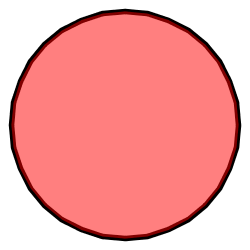
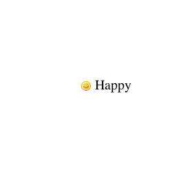
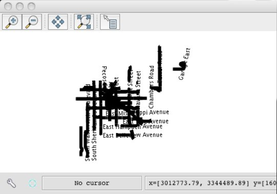
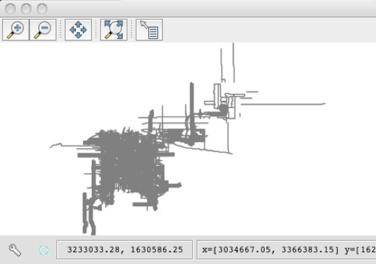
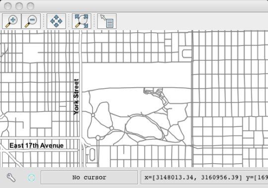

.. _tutorials.style-basic:

Styling and Rendering
=====================

.. cssclass:: show-chooser

.. rubric:: code chooser

This tutorial introduces the modules used for styling and rendering, covering the following topics:

* Basic styling with symbolizers
* Labelling
* Thematic styling
* Scale dependent rendering

Prerequisites
-------------

The :ref:`tutorials.data-basic` tutorial must be completed before proceeding as the data set up 
there will be used as the base of this tutorial.

Download `smiley.png <http://data.opengeo.org/geoscript/smiley.png>`_ and save it in the working directory.

Symbolizers
-----------

A *Symbolizer* object describes a component of a style. Types of symbolizers include fill, stroke, shape, labels, etc... 

A style is built by composing different symbolizers together. 

.. cssclass:: code py

.. code-block:: python

   >>> from geoscript.style import *
   >>> from geoscript.render import *
   >>> from geoscript.geom import *
   >>> from geoscript.feature import *

   >>> style = Stroke('black', width=2) + Fill('#ff0000', opacity=0.75)
   >>> draw(Point(0,0).buffer(1), style)   

   >>> mpoint = readWKT('MULTIPOINT ((10 40), (40 30), (20 20), (30 10))')
   >>> draw(mpoint, Shape('red', type='triangle', size=20))

   >>> draw()
   >>> feature = Feature({'geom':Point(0,0), 'name': 'Happy'})
   >>> draw(feature, Icon('smiley.png') + Label('name', '20pt').point(anchor=(-0.25,0.5)))

.. cssclass:: code js

.. code-block:: javascript

    js> var {Stroke, Fill, Shape, Icon} = require("geoscript/style");

    js> var style = Stroke({brush: "black", width: 2}).and(Fill({brush: "#ff0000", opacity: 0.75}))
    js> style
    <Style parts: <Stroke width: 2, opacity: 1, brush: <Color value: '#...>

    js> var shape = Shape({name: "triangle", size: 20})
    js> shape
    <Shape name: 'triangle', size: 20>

    js> var icon = Icon("smiley.png");

.. cssclass:: code groovy

.. code-block:: groovy

    groovy:000> import geoscript.style.*
    groovy:000> import static geoscript.render.Draw.draw
    groovy:000> import geoscript.geom.*
    groovy:000> import geoscript.feature.*

    groovy:000> style = new Stroke("black",2) + new Fill("#ff0000",0.75)
    groovy:000> draw(new Point(0,0).buffer(1), style)

    groovy:000> mpoint = Geometry.fromWKT("MULTIPOINT ((10 40), (40 30), (20 20), (30 10))")
    groovy:000> draw(mpoint, new Shape("red",20,"triangle"))

    groovy:000> feature = new Feature(["geom": new Point(0,0), "name": "Happy"],"happy1")
    groovy:000> draw(feature, new Icon(url: "smileyface.png",  size: 12) + new Label("name").font(size:20).point(anchor:[-0.25,0.5]))

.. image:: sym2.png

.. cssclass:: refs py

.. seealso::

   `style API reference <../../py/api/style/index.html>`__
   `render API reference <../../py/api/render/index.html>`__

.. cssclass:: refs js

.. seealso::

   `style API reference <../../js/api/style.html>`__

Thematic Styling
----------------

Often styling rules are created based on values for attributes in a dataset. Using the highway 
layer as an example determine the space of values for the "TYPE" attribute.

.. cssclass:: code py

.. code-block:: python

   >>> from geoscript.workspace import PostGIS
   >>> db = PostGIS('denver')
   
   >>> hwy = db['highway']
   >>> hwy.schema
   highway [the_geom: MultiLineString, TYPE: str, NAME: str, ONEWAY: str, LANES: long]

   >>> set([f['TYPE'] for f in hwy.features()])
   set([u'road', u'bridleway', u'service', u'trunk', u'primary_link', u'unclassified', u'motorway', u'path', u'tertiary_link', u'secondary', u'steps', u'secondary_link', u'trunk_link', u'pedestrian', u'footway', u'residential', u'primary', u'tertiary', u'motorway_link', u'track', u'crossing', u'cycleway'])

.. cssclass:: code js

.. code-block:: javascript

    js> var PostGIS = require("geoscript/workspace").PostGIS

    js> var db = PostGIS("denver")
    js> db
    <PostGIS ["census_boundaries", "city_boundary", "election_precincts",...>
    
    js> var hwy = db.get("highway")
    js> hwy.schema.fields
    <Field name: "the_geom", type: MultiLineString>,<Field name: "TYPE", type: String>,<Field name: "NAME", type: String>,<Field name: "ONEWAY", type: String>,<Field name: "LANES", type: Long>
    
.. cssclass:: code groovy

.. code-block:: groovy

    groovy:000> import geoscript.workspace.PostGIS

    groovy:000> db = new PostGIS("denver", user: "postgres")
    groovy:000> hwy = db['highway']
    groovy:000> hwy.schema
    ===> highway the_geom: MultiLineString(EPSG:2877), TYPE: String, NAME: String, ONEWAY: String, LANES: Long

    groovy:000> types = [] as Set
    groovy:000> c = hwy.cursor
    groovy:000> while(c.hasNext()) {
    groovy:000>     types.add(c.next().get("TYPE"))
    groovy:000> }
    groovy:000> c.close()
    groovy:000> types
    ===> [crossing, boat ramp, Mine road, bus_guideway, unclassified, cycleway, secondary, residential;service, drive_through, road, USFS, private, secondary_link, cossing, tertiary_link, tertiary, pedestrian, raceway, trail, primary, path, ford, construction, bridleway, residential; service, track, motorway_link, motorway, steps, footway, trunk_link, yes, primary_link, trunk, service, residential;tertiary, living_street, abandoned]

Create styling rules to style "primary" and "secondary" highways.

.. cssclass:: code py

.. code-block:: python

   >>> style = (Stroke(width=5) + Label('NAME').linear()).where("TYPE = 'primary' OR TYPE = 'secondary'")
   >>> draw(hwy, style, format='mapwindow')

.. cssclass:: code js

.. code-block:: javascript

    js> var viewer = require("geoscript/viewer");
    js> var {Stroke, Label} = require("geoscript/style");

    js> hwy.style = Stroke({width: 5}).and(Label("NAME")).where("TYPE = 'primary' OR TYPE = 'secondary'")
    <Style parts: <Stroke width: 5, opacity: 1, brush: <Color value: '#...>

    js> viewer.draw(hwy)

.. cssclass:: code groovy

.. code-block:: groovy

    groovy:000> hwy.style = (new Stroke(width:5) + new Label("NAME").linear()).where("TYPE = 'primary' OR TYPE = 'secondary'")
    groovy:000> draw(hwy)

In the above the *where* method is used to provide a filter/predicate that constrains what the 
rule should apply too. 

The result is not very visually appealing. Create a more visually appealing style.

.. cssclass:: code py

.. code-block:: python

   >>> label = Label('NAME', font='bold Arial 12pt').linear(group=True, follow=True, offset=10)
   >>> style = (Stroke('gray', width=5) + label).where("TYPE = 'primary' OR TYPE = 'secondary'")

   >>> style += Stroke('gray', width=3).where("TYPE = 'primary' OR TYPE = 'secondary'").zindex(1)
   >>> draw(hwy, style, format='mapwindow')

.. cssclass:: code js

.. code-block:: javascript

    js> hwy.style = Stroke({brush: "gray", width: 5}).and(Label({fontFamily: "Arial", fontSize: 12, fontWeight: "bold"})).where("TYPE = 'primary' OR TYPE = 'secondary'")
    <Style parts: <Stroke width: 5, opacity: 1, brush: <Color value: '#...>
    js> viewer.draw(hwy)

.. cssclass:: code groovy

.. code-block:: groovy

    groovy:000> label = new Label("NAME").font(weight: "bold", family: "Arial", size:12).linear(group: true, follow:true, offset: 10)
    groovy:000> style = (new Stroke("gray", 5) + label).where("TYPE = 'primary' OR TYPE = 'secondary'")

    groovy:000> style += new Stroke("white", 3).where("TYPE = 'primary' OR TYPE = 'secondary'").zindex(1)
    groovy:000> hwy.style = style
    groovy:000> draw(hwy)

Above a second stroke was added in order to render a second (slightly) thinner line on top of the existing line. The second stroke is given a *z-index* of 1 to force it to be drawn
on top of the first stroke, creating a "line-casing" affect.

Now add another rule that encompasses the rest of the roads.

.. cssclass:: code py

.. code-block:: python

   >>> style += Stroke('gray', width=1)
   >>> draw(hwy, style, format='mapwindow')

.. cssclass:: code groovy

.. code-block:: groovy

    groovy:000> hwy.style += new Stroke("gray",1)
    groovy:000> draw(hwy)

.. cssclass:: refs py

.. seealso::

   `style API reference <../../py/api/style/index.html>`__
   `render API reference <../../py/api/render/index.html>`__

.. cssclass:: refs js

.. seealso::

   `style API reference <../../js/api/style.html>`__

.. cssclass:: refs groovy

.. seealso::

   `style API reference <../../groovy/api/geoscript/style/package-summary.html>`__
   `render API reference <../../groovy/api/geoscript/render/package-summary.html>`__

Scale Dependant Rendering
-------------------------

The style created in the previous section is two crowded and clearly lacks some scale rules to 
constrain the data drawn at various map scales. 

Modify the styles so that non primary roads show up at scales smaller than 1:100K. At scales smaller than 1:25K add labels to the non primary/secondary roads.

.. cssclass:: code py

.. code-block:: python

   >>> label = Label('NAME', font='bold Arial 12pt').linear(group=True, follow=True, offset=10)
   >>> style = (Stroke('gray', width=5) + label).where("TYPE = 'primary' OR TYPE = 'secondary'")
   >>> style += Stroke('white', width=3).where("TYPE = 'primary' OR TYPE = 'secondary'").zindex(1)

   # add non primary/secondary roads at scale < 1:100K
   >>> style += Stroke('gray', width=1).range(max=100000)

   # add label at scale < 1:25K
   >>> style += Label('NAME', font='bold Arial 12pt').linear(group=True, follow=True, offset=10).range(max=25000)
  
   >>> draw(hwy, style, format='mapwindow')

.. cssclass:: code groovy

.. code-block:: groovy

    groovy:000> hwy.style += new Stroke("gray",1)
    groovy:000> draw(hwy)

    groovy:000> label = new Label("NAME").font(weight:"bold", family:"Arial", size:12).linear(group:true, follow:true, offset:10)
    groovy:000> style = (new Stroke("gray", 5) + label).where("TYPE = 'primary' OR TYPE = 'secondary'")
    groovy:000> style += new Stroke("white", 3).where("TYPE = 'primary' OR TYPE = 'secondar'").zindex(1)

    groovy:000> style += new Stroke("gray", 1).range(-1, 100000)
    groovy:000> style += new Label("NAME").font(weight:"bold", family:"Arial", size:12).linear(group:true, follow:true, offset:10).range(-1, 25000)

    groovy:000> hwy.style = style
    groovy:000> new MapWindow(new Map(layers: [hwy]))

.. cssclass:: code py
  
The *range* function is used to apply scale constraints to a symbolizer. Values are specified as 
scale denominators.

