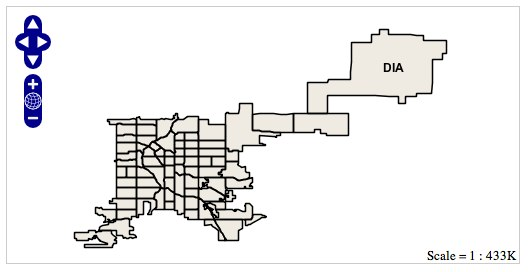

.. _tutorials.web-flask-py:

Geo Web Applications with Flask
===============================

This tutorial covers building a simple web application with the `Flask <>` micro web framework.

    Flask is a microframework for Python based on Werkzeug, Jinja 2 and good intentions.

With Flask we will build a simple Web Map Server (WMS) to serve a map created in previous tutorials.

Prerequisites
-------------

The :ref:`tutorials.data-basic` tutorial must be completed before proceeding as the data set up 
there will be used as the base of this tutorial. It is also recommended that the :ref:`tutorials.style-basic` 
and :ref:`tutorials.style-theming-py` tutorials be completed as well.

Installing Flask
----------------
    
The easiest way to install Flask is with `easy_install`::

  % easy_install flask

Creating a simple WMS
---------------------

Create a file named :file:`wms.py` and create the skeleton for a Flask application:

.. cssclass:: code py

.. code-block:: python

   from flask import *

   app = Flask(__name__) 

   @app.route("/")
   def wms():
     pass

   if __name__ == "__main__":
     app.run(debug=True)

Before the *app* function create a new PostGIS workspace pointing at the "denver" database. And build a map out of the 
"city_boundary", "neighbourhood", and "highway" layers:

.. cssclass:: code py

.. code-block:: python

    from flask import *

    from geoscript.workspace import PostGIS
    from geoscript.render import Map

    pg = PostGIS('denver')

    bndry = pg['city_boundary']
    hwy = pg['highway']
    hoods = pg['neighborhoods']

    app = Flask(__name__) 
    ...

Add some styling to the layers and create the *Map*:

.. cssclass:: code py

.. code-block:: python

    bndry.style = Fill('#efebe2')

    thin = Stroke('gray',1)
    think = Stroke('gray',5) + Stroke('white',3).zindex(1) + Label('NAME').linear(follow=True,group=True)
    hwy.style = (thin.range(min=2E5) + think.range(max=2E5)).where("TYPE = 'primary' OR TYPE = 'secondary'") + thin.range(max=5E4)

    hoods.style = Stroke() + Label('NAME', 'bold Arial 12pt')

    map = Map([bndry, hoods, highways])

Inside of the *app* function add code to parse the "WIDTH", "HEIGHT", "SRS", and "PROJ" parameters from the request object, render the map, and send back the response:

.. cssclass:: code py

.. code-block:: python

    @app.route("/")
    def wms():
       q = request.args

       # parse width/height
       size = (int(q['WIDTH']), int(q['HEIGHT']))

       # parse srs
       prj = proj.Projection(q['SRS'])

       # parse the bounds
       bounds = geom.Bounds(*([float(x) for x in q['BBOX'].split(',')]+[prj]))

       # render the image
       img = map.render(size=size, bounds=bounds, format='png', strencode=True)

       resp = make_response(data, 200)
       resp.headers['Content-type'] = 'image/png'
       return resp

Running the WMS
---------------

Start the Flask server to start the WMS by running the :file:`wms.py` script::

  % jython wms.py 
  * Running on http://127.0.0.1:5000/
  * Restarting with reloader

Create a new file :file:`wms.html` with the following contents:

.. code-block:: html

	<!DOCTYPE html>
	<html>
	  <head>
	    
	    
	    
	  </head>
	  <body onload="init()">
	    

	  </body>
	</html>

Open :file:`wms.html` in a web browser.

